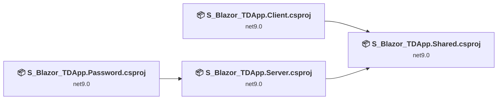
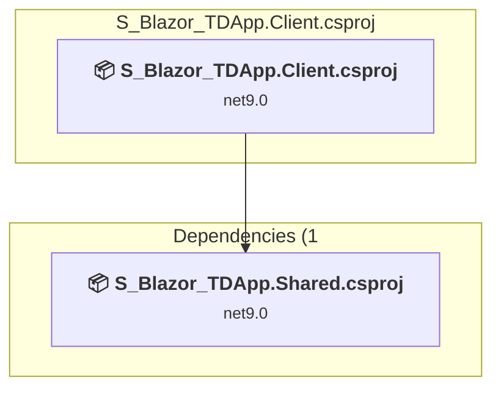
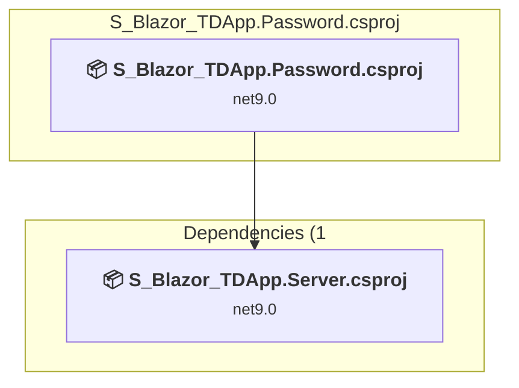
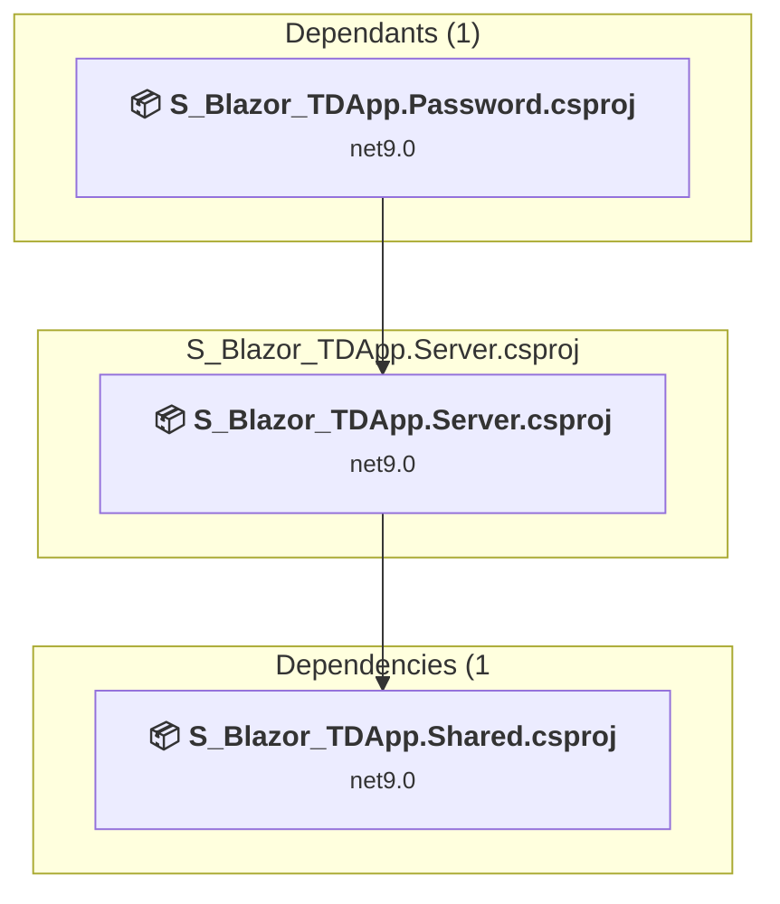
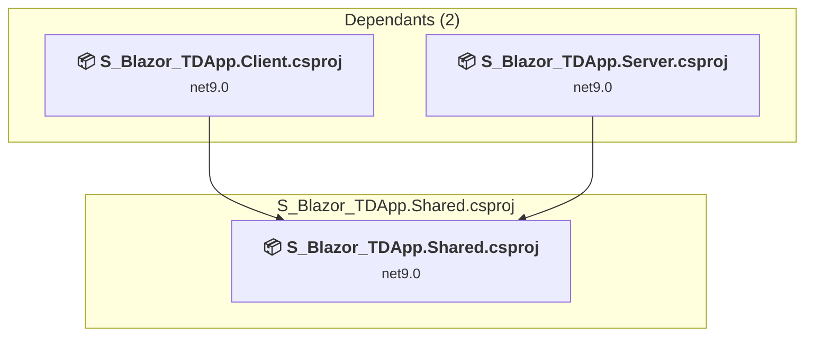

# Projects and dependencies analysis

This document provides a comprehensive overview of the projects and their dependencies in the context of upgrading to .NETCoreApp,Version=v10.0.

## Table of Contents

- [Executive Summary](#executive-Summary)
  - [Highlevel Metrics](#highlevel-metrics)
  - [Projects Compatibility](#projects-compatibility)
  - [Package Compatibility](#package-compatibility)
  - [API Compatibility](#api-compatibility)
- [Aggregate NuGet packages details](#aggregate-nuget-packages-details)
- [Top API Migration Challenges](#top-api-migration-challenges)
  - [Technologies and Features](#technologies-and-features)
  - [Most Frequent API Issues](#most-frequent-api-issues)
- [Projects Relationship Graph](#projects-relationship-graph)
- [Project Details](#project-details)

  - [S_Blazor_TDApp.Client\S_Blazor_TDApp.Client.csproj](#s_blazor_tdappclients_blazor_tdappclientcsproj)
  - [S_Blazor_TDApp.Password\S_Blazor_TDApp.Password.csproj](#s_blazor_tdapppasswords_blazor_tdapppasswordcsproj)
  - [S_Blazor_TDApp.Server\S_Blazor_TDApp.Server.csproj](#s_blazor_tdappservers_blazor_tdappservercsproj)
  - [S_Blazor_TDApp.Shared\S_Blazor_TDApp.Shared.csproj](#s_blazor_tdappshareds_blazor_tdappsharedcsproj)

## Executive Summary

### Highlevel Metrics

| Metric | Count | Status |
| :--- | :---: | :--- |
| Total Projects | 4 | All require upgrade |
| Total NuGet Packages | 10 | 7 need upgrade |
| Total Code Files | 48 |  |
| Total Code Files with Incidents | 14 |  |
| Total Lines of Code | 3074 |  |
| Total Number of Issues | 52 |  |
| Estimated LOC to modify | 41+ | at least 1.3% of codebase |

### Projects Compatibility

| Project | Target Framework | Difficulty | Package Issues | API Issues | Est. LOC Impact | Description |
| :--- | :---: | :---: | :---: | :---: | :---: | :--- |
| [S_Blazor_TDApp.Client\S_Blazor_TDApp.Client.csproj](#s_blazor_tdappclients_blazor_tdappclientcsproj) | net9.0 | 🟢 Low | 4 | 40 | 40+ | AspNetCore, Sdk Style = True |
| [S_Blazor_TDApp.Password\S_Blazor_TDApp.Password.csproj](#s_blazor_tdapppasswords_blazor_tdapppasswordcsproj) | net9.0 | 🟢 Low | 0 | 0 |  | DotNetCoreApp, Sdk Style = True |
| [S_Blazor_TDApp.Server\S_Blazor_TDApp.Server.csproj](#s_blazor_tdappservers_blazor_tdappservercsproj) | net9.0 | 🟢 Low | 3 | 1 | 1+ | AspNetCore, Sdk Style = True |
| [S_Blazor_TDApp.Shared\S_Blazor_TDApp.Shared.csproj](#s_blazor_tdappshareds_blazor_tdappsharedcsproj) | net9.0 | 🟢 Low | 0 | 0 |  | ClassLibrary, Sdk Style = True |

### Package Compatibility

| Status | Count | Percentage |
| :--- | :---: | :---: |
| ✅ Compatible | 3 | 30.0% |
| ⚠️ Incompatible | 1 | 10.0% |
| 🔄 Upgrade Recommended | 6 | 60.0% |
| ***Total NuGet Packages*** | ***10*** | ***100%*** |

### API Compatibility

| Category | Count | Impact |
| :--- | :---: | :--- |
| 🔴 Binary Incompatible | 1 | High - Require code changes |
| 🟡 Source Incompatible | 2 | Medium - Needs re-compilation and potential conflicting API error fixing |
| 🔵 Behavioral change | 38 | Low - Behavioral changes that may require testing at runtime |
| ✅ Compatible | 13384 |  |
| ***Total APIs Analyzed*** | ***13425*** |  |

## Aggregate NuGet packages details

| Package | Current Version | Suggested Version | Projects | Description |
| :--- | :---: | :---: | :--- | :--- |
| AutoMapper | 14.0.0 |  | [S_Blazor_TDApp.Server.csproj](#s_blazor_tdappservers_blazor_tdappservercsproj) | ✅Compatible |
| Blazored.SessionStorage | 2.4.0 |  | [S_Blazor_TDApp.Client.csproj](#s_blazor_tdappclients_blazor_tdappclientcsproj) | ⚠️El paquete NuGet está en desuso |
| CurrieTechnologies.Razor.SweetAlert2 | 5.6.0 |  | [S_Blazor_TDApp.Client.csproj](#s_blazor_tdappclients_blazor_tdappclientcsproj) | ✅Compatible |
| Microsoft.AspNetCore.Components.Authorization | 9.0.3 | 10.0.3 | [S_Blazor_TDApp.Client.csproj](#s_blazor_tdappclients_blazor_tdappclientcsproj) | Se recomienda actualizar el paquete NuGet |
| Microsoft.AspNetCore.Components.WebAssembly | 9.0.3 | 10.0.3 | [S_Blazor_TDApp.Client.csproj](#s_blazor_tdappclients_blazor_tdappclientcsproj) | Se recomienda actualizar el paquete NuGet |
| Microsoft.AspNetCore.Components.WebAssembly.DevServer | 9.0.3 | 10.0.3 | [S_Blazor_TDApp.Client.csproj](#s_blazor_tdappclients_blazor_tdappclientcsproj) | Se recomienda actualizar el paquete NuGet |
| Microsoft.AspNetCore.OpenApi | 9.0.3 | 10.0.3 | [S_Blazor_TDApp.Server.csproj](#s_blazor_tdappservers_blazor_tdappservercsproj) | Se recomienda actualizar el paquete NuGet |
| Microsoft.EntityFrameworkCore.SqlServer | 9.0.3 | 10.0.3 | [S_Blazor_TDApp.Server.csproj](#s_blazor_tdappservers_blazor_tdappservercsproj) | Se recomienda actualizar el paquete NuGet |
| Microsoft.EntityFrameworkCore.Tools | 9.0.3 | 10.0.3 | [S_Blazor_TDApp.Server.csproj](#s_blazor_tdappservers_blazor_tdappservercsproj) | Se recomienda actualizar el paquete NuGet |
| Swashbuckle.AspNetCore | 7.2.0 |  | [S_Blazor_TDApp.Server.csproj](#s_blazor_tdappservers_blazor_tdappservercsproj) | ✅Compatible |

## Top API Migration Challenges

### Technologies and Features

| Technology | Issues | Percentage | Migration Path |
| :--- | :---: | :---: | :--- |

### Most Frequent API Issues

| API | Count | Percentage | Category |
| :--- | :---: | :---: | :--- |
| T:System.Net.Http.HttpContent | 35 | 85.4% | Behavioral Change |
| M:System.TimeSpan.FromSeconds(System.Int64) | 2 | 4.9% | Source Incompatible |
| T:System.Uri | 2 | 4.9% | Behavioral Change |
| M:System.Uri.#ctor(System.String) | 1 | 2.4% | Behavioral Change |
| T:Microsoft.Extensions.DependencyInjection.ServiceCollectionExtensions | 1 | 2.4% | Binary Incompatible |

## Projects Relationship Graph

Legend:
📦 SDK-style project
⚙️ Classic project

## Project Details

### S_Blazor_TDApp.Client\S_Blazor_TDApp.Client.csproj

#### Project Info

- **Current Target Framework:** net9.0
- **Proposed Target Framework:** net10.0
- **SDK-style**: True
- **Project Kind:** AspNetCore
- **Dependencies**: 1
- **Dependants**: 0
- **Number of Files**: 40
- **Number of Files with Incidents**: 10
- **Lines of Code**: 806
- **Estimated LOC to modify**: 40+ (at least 5.0% of the project)

#### Dependency Graph

Legend:
📦 SDK-style project
⚙️ Classic project

### API Compatibility

| Category | Count | Impact |
| :--- | :---: | :--- |
| 🔴 Binary Incompatible | 0 | High - Require code changes |
| 🟡 Source Incompatible | 2 | Medium - Needs re-compilation and potential conflicting API error fixing |
| 🔵 Behavioral change | 38 | Low - Behavioral changes that may require testing at runtime |
| ✅ Compatible | 10762 |  |
| ***Total APIs Analyzed*** | ***10802*** |  |

### S_Blazor_TDApp.Password\S_Blazor_TDApp.Password.csproj

#### Project Info

- **Current Target Framework:** net9.0
- **Proposed Target Framework:** net10.0
- **SDK-style**: True
- **Project Kind:** DotNetCoreApp
- **Dependencies**: 1
- **Dependants**: 0
- **Number of Files**: 1
- **Number of Files with Incidents**: 1
- **Lines of Code**: 5
- **Estimated LOC to modify**: 0+ (at least 0.0% of the project)

#### Dependency Graph

Legend:
📦 SDK-style project
⚙️ Classic project

### API Compatibility

| Category | Count | Impact |
| :--- | :---: | :--- |
| 🔴 Binary Incompatible | 0 | High - Require code changes |
| 🟡 Source Incompatible | 0 | Medium - Needs re-compilation and potential conflicting API error fixing |
| 🔵 Behavioral change | 0 | Low - Behavioral changes that may require testing at runtime |
| ✅ Compatible | 5 |  |
| ***Total APIs Analyzed*** | ***5*** |  |

### S_Blazor_TDApp.Server\S_Blazor_TDApp.Server.csproj

#### Project Info

- **Current Target Framework:** net9.0
- **Proposed Target Framework:** net10.0
- **SDK-style**: True
- **Project Kind:** AspNetCore
- **Dependencies**: 1
- **Dependants**: 1
- **Number of Files**: 22
- **Number of Files with Incidents**: 2
- **Lines of Code**: 1975
- **Estimated LOC to modify**: 1+ (at least 0.1% of the project)

#### Dependency Graph

Legend:
📦 SDK-style project
⚙️ Classic project

### API Compatibility

| Category | Count | Impact |
| :--- | :---: | :--- |
| 🔴 Binary Incompatible | 1 | High - Require code changes |
| 🟡 Source Incompatible | 0 | Medium - Needs re-compilation and potential conflicting API error fixing |
| 🔵 Behavioral change | 0 | Low - Behavioral changes that may require testing at runtime |
| ✅ Compatible | 2249 |  |
| ***Total APIs Analyzed*** | ***2250*** |  |

### S_Blazor_TDApp.Shared\S_Blazor_TDApp.Shared.csproj

#### Project Info

- **Current Target Framework:** net9.0
- **Proposed Target Framework:** net10.0
- **SDK-style**: True
- **Project Kind:** ClassLibrary
- **Dependencies**: 0
- **Dependants**: 2
- **Number of Files**: 12
- **Number of Files with Incidents**: 1
- **Lines of Code**: 288
- **Estimated LOC to modify**: 0+ (at least 0.0% of the project)

#### Dependency Graph

Legend:
📦 SDK-style project
⚙️ Classic project

### API Compatibility

| Category | Count | Impact |
| :--- | :---: | :--- |
| 🔴 Binary Incompatible | 0 | High - Require code changes |
| 🟡 Source Incompatible | 0 | Medium - Needs re-compilation and potential conflicting API error fixing |
| 🔵 Behavioral change | 0 | Low - Behavioral changes that may require testing at runtime |
| ✅ Compatible | 368 |  |
| ***Total APIs Analyzed*** | ***368*** |  |

